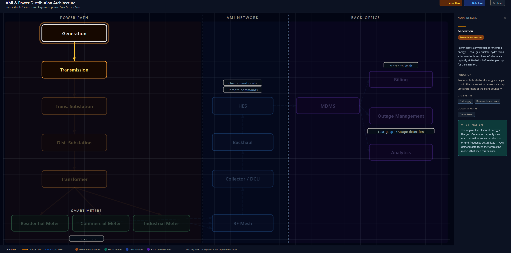
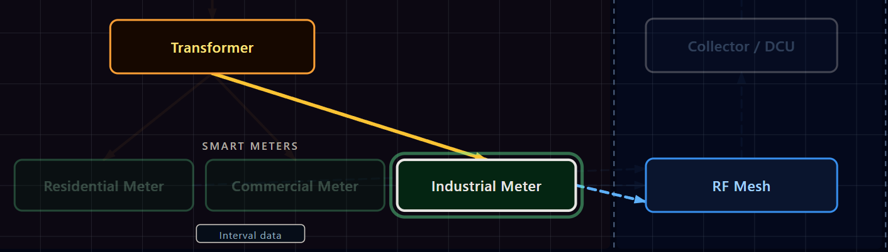
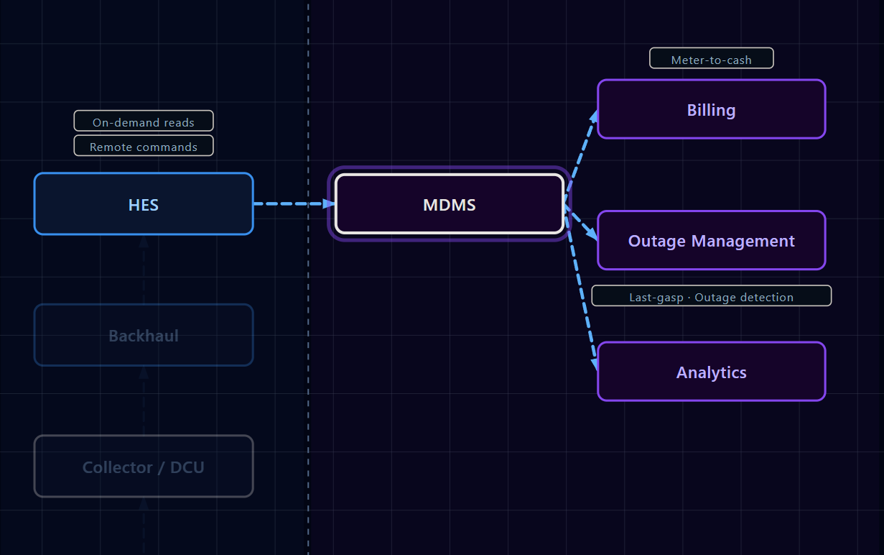

# AMI & Power Distribution — Interactive Architecture Diagram

A professional, interactive web application that visualizes **electric power distribution** and **Advanced Metering Infrastructure (AMI)** — from power generation all the way through to billing, outage management, and analytics.

Built as a portfolio-quality, enterprise-style learning tool for engineers, product teams, and anyone studying modern utility infrastructure.

---

## Screenshots







---

## Overview

Modern electric utilities operate two parallel systems: a **physical power network** that delivers electricity, and a **digital AMI network** that reads meters, detects outages, and enables two-way communication with every customer endpoint. This diagram maps both systems and shows how they interconnect.

```
Generation → Transmission → Substation → Distribution → Smart Meter
                                                              ↓
                                                          RF Mesh
                                                              ↓
                                                      Collector / DCU
                                                              ↓
                                                         Backhaul
                                                              ↓
                                              HES → MDMS → Billing / OMS / Analytics
```

---

## Features

- **Interactive node selection** — click any component to see its role, upstream/downstream connections, and why it matters
- **Power flow visualization** — trace electricity from generation to end-use
- **Data flow visualization** — follow meter reads from device to back-office system
- **Layer toggles** — show/hide power flow and data flow independently
- **Detail panel** — per-node descriptions covering function, category, and significance
- **Enterprise aesthetic** — clean slate/blue palette, no chart-junk, readable at a glance

---

## Architecture Coverage

### Power Infrastructure

| Node | Description |
|------|-------------|
| Generation | Power plant — coal, gas, nuclear, solar, wind |
| Transmission | High-voltage backbone (345 kV–765 kV) |
| Transmission Substation | Steps voltage down for regional distribution |
| Distribution Substation | Further steps down for neighborhoods (4–35 kV) |
| Transformer | Pole/pad-mount unit stepping down to 120/240 V |
| Residential Meter | Smart endpoint at a home |
| Commercial Meter | Smart endpoint at a business |
| Industrial Meter | High-capacity smart endpoint at an industrial site |

### AMI Network

| Node | Description |
|------|-------------|
| RF Mesh | Short-range radio network linking meters to collectors |
| Collector / DCU | Data Concentrator Unit — aggregates reads from hundreds of meters |
| Backhaul | WAN link (cellular, fiber, licensed RF) carrying data to the utility |
| HES | Head-End System — AMI ingestion engine, manages meter commands |
| MDMS | Meter Data Management System — stores, validates, and processes interval data |
| Billing | Revenue cycle system consuming validated usage data |
| Outage Management | OMS — correlates last-gasp signals to build outage maps |
| Analytics | Interval data analytics — load forecasting, demand response, loss detection |

---

## Tech Stack

| Layer | Technology |
|-------|------------|
| Framework | React 19 + TypeScript |
| Styling | Tailwind CSS v4 |
| Diagram | Hand-authored SVG (no diagram library dependency) |
| Bundler | Vite 8 |

No backend. No database. No auth. Purely static — deploy anywhere.

---

## Getting Started

### Prerequisites

- Node.js 18+
- npm 9+

### Install & run

```bash
git clone https://github.com/ajcondondev/ami-power-diagram.git
cd ami-power-diagram
npm install
npm run dev
```

Open `http://localhost:5173` in your browser.

### Build for production

```bash
npm run build
```

Output lands in `dist/` — ready to serve from any static host (Netlify, Vercel, GitHub Pages, S3).

---

## Project Structure

```
src/
├── components/
│   ├── Header.tsx          # App header with title and flow-type hints
│   ├── DiagramPlaceholder.tsx  # SVG diagram canvas (Phase 2+)
│   ├── DetailPanel.tsx     # Node detail sidebar
│   └── Legend.tsx          # Footer legend
├── data/                   # Node definitions and connection graph
├── types/                  # TypeScript interfaces
├── App.tsx
└── main.tsx
```

---

## Roadmap

- [x] **Phase 1** — App shell: layout, header, placeholders, legend, styling
- [x] **Phase 2** — Core SVG diagram: all nodes positioned, labeled, flow arrows drawn
- [x] **Phase 3** — Interactivity: node click → detail panel with rich content
- [x] **Phase 4** — Layer toggles, hover highlights, selected path emphasis
- [x] **Phase 5** — Polish, concept callouts, responsiveness, portfolio-ready finish

---

## Domain Concepts

**AMI (Advanced Metering Infrastructure)** — the two-way communication network between utility back-office systems and smart meters at every customer endpoint. Enables remote reads, time-of-use rates, outage detection via last-gasp signals, and demand response programs.

**HES (Head-End System)** — the AMI ingestion layer. Schedules reads, pushes firmware updates, sends remote disconnect/reconnect commands, and surfaces meter events in real time.

**MDMS (Meter Data Management System)** — the system of record for interval data. Validates reads against expected patterns, fills estimated gaps, and exposes clean usage data to downstream systems (billing, analytics, CIS).

**Last Gasp** — a signal a smart meter transmits the instant it loses power, allowing the OMS to pinpoint outage locations before any customer calls.

---

## License

MIT
