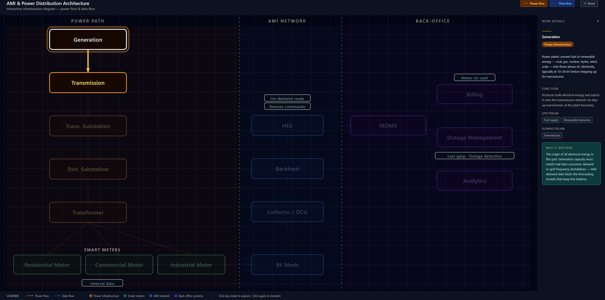
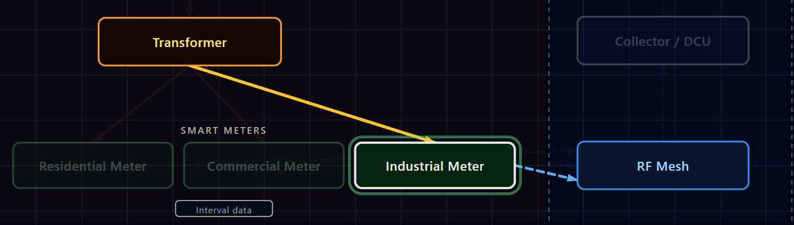
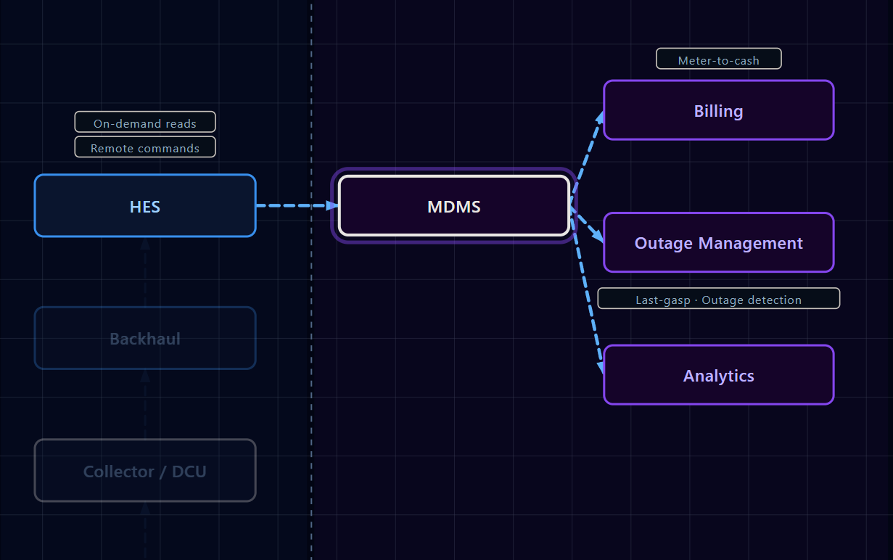

# AMI & Power Distribution: Interactive Architecture Diagram

An interactive diagram of electric power distribution and Advanced Metering Infrastructure (AMI), tracing the path from power generation through smart meters to the back-office systems that handle billing, outage management, and analytics.

**[Live demo](https://ajcondondev.github.io/ami-power-diagram/)** (GitHub Pages)

## Screenshots







## What it demonstrates

Modern electric utilities operate two parallel systems: a physical power network that delivers electricity, and a digital AMI network that reads meters, detects outages, and enables two-way communication with customer endpoints. This diagram maps both systems and shows how they interconnect.

```
Power Grid
  Generation -> Transmission -> Tx Substation -> Dist Substation -> Transformer -> Smart Meter

AMI Network
  Smart Meter -> RF Mesh -> Collector/DCU -> Backhaul -> HES -> MDMS -> Billing / OMS / Analytics
```

The app covers 16 nodes: five power-infrastructure stages, three meter types (residential, commercial, industrial), four AMI network layers (RF mesh, collector/DCU, backhaul, HES), and four back-office systems (MDMS, billing, outage management, analytics).

## Features

- Click any node to open a detail panel with its function, upstream/downstream connections, why it matters, and related concepts
- Independent show/hide toggles for the power flow and data flow layers
- Hover highlighting and emphasis of the selected node's connection paths
- Resizable detail panel
- Concept callouts explaining AMI terms (last gasp, interval data, remote disconnect, and others) in context

## Tech stack

- React 19 + TypeScript
- Tailwind CSS 4 (via `@tailwindcss/vite`)
- Vite
- Hand-authored SVG for the diagram (no diagram library)

The app is fully static: no backend, database, or authentication. It can be served from any static host.

## Getting started

Requires Node.js 20 or later.

```bash
git clone https://github.com/ajcondondev/ami-power-diagram.git
cd ami-power-diagram
npm install
npm run dev
```

Open `http://localhost:5173` in your browser.

Other scripts:

```bash
npm run build     # type-check and build to dist/
npm run preview   # serve the production build locally
npm run lint      # run ESLint
```

A GitHub Actions workflow (`.github/workflows/pages.yml`) builds and deploys the app to GitHub Pages on each push to master.

## Project structure

```
src/
├── components/
│   ├── Header.tsx       # Title bar with flow toggles and reset
│   ├── Diagram.tsx      # SVG diagram canvas
│   ├── DetailPanel.tsx  # Resizable node detail sidebar
│   └── Legend.tsx       # Footer legend
├── data/                # Node definitions, connections, and detail content
├── types/               # TypeScript interfaces
├── App.tsx
└── main.tsx
```

## Domain concepts

- **AMI (Advanced Metering Infrastructure):** the two-way communication network between utility back-office systems and smart meters. Enables remote reads, time-of-use rates, outage detection, and demand response.
- **HES (Head-End System):** the AMI ingestion layer. Schedules reads, pushes firmware updates, sends remote disconnect/reconnect commands, and surfaces meter events.
- **MDMS (Meter Data Management System):** the system of record for interval data. Validates reads, fills estimated gaps, and supplies clean usage data to billing and analytics.
- **Last gasp:** a signal a smart meter transmits when it loses power, letting the outage management system locate outages before customers call.

These terms are also explained inline in the app: click a node to see contextual definitions.

## Notes

This is an educational visualization. The architecture is simplified and generic; it does not represent any specific utility's actual systems.

## License

MIT
